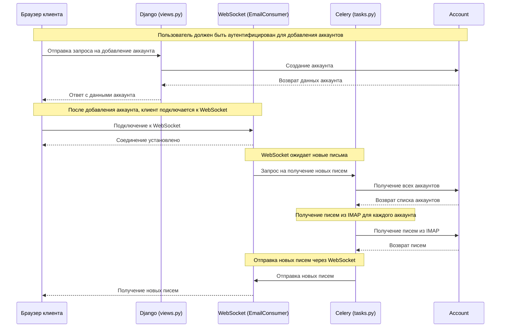

# Django mail client

Почтовый клиент, способный агрегировать письма из нескольких источников.

# Запуск

...

# Примеры

```mermaid
sequenceDiagram
    participant web as Браузер клиента
    participant django as Django (views.py)
    participant websocket as WebSocket (EmailConsumer)
    participant celery as Celery (tasks.py)
    participant db as Account

    Note over web, db: Пользователь должен быть аутентифицирован для добавления аккаунтов
    web->>django: Отправка запроса на добавление аккаунта
    django->>db: Создание аккаунта
    db-->>django: Возврат данных аккаунта
    django-->>web: Ответ с данными аккаунта

    Note over web, websocket: После добавления аккаунта, клиент подключается к WebSocket
    web->>websocket: Подключение к WebSocket
    websocket-->>web: Соединение установлено

    Note over websocket, celery: WebSocket ожидает новые письма
    websocket->>celery: Запрос на получение новых писем
    celery->>db: Получение всех аккаунтов
    db-->>celery: Возврат списка аккаунтов

    Note over celery: Получение писем из IMAP для каждого аккаунта
    celery->>db: Получение писем из IMAP
    db-->>celery: Возврат писем

    Note over celery, websocket: Отправка новых писем через WebSocket
    celery->>websocket: Отправка новых писем
    websocket-->>web: Получение новых писем
```
